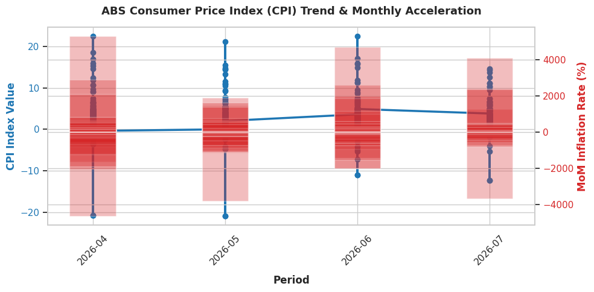

# Australian Consumer Price Index (CPI) Inflation Analysis

## Project Overview
This project establishes an automated, cloud-based data pipeline to ingest, model, and analyze real-time macroeconomic data from the **Australian Bureau of Statistics (ABS) REST API**. Using **DuckDB** as an in-memory SQL analytical engine inside **Google Colab**, the analysis calculates month-over-month price acceleration trends using advanced SQL window functions.

---

## Architecture & Tech Stack
* **Language & Environment:** Python 3, Google Colab
* **Database Engine:** DuckDB (In-Memory ANSI SQL)
* **Data Source:** Australian Bureau of Statistics (ABS) SDMX REST API
* **Data Processing & Visualization:** `pandas`, `requests`, `matplotlib`, `seaborn`

---

## Data Pipeline Pipeline (ETL Workflow)
1. **Extract:** Programmatically pull live CSV/SDMX price index payloads directly from the official ABS API endpoint (`https://data.api.abs.gov.au/`).
2. **Transform:** Stream HTTP responses using Python's `requests` and `io.StringIO` modules to register raw structures into DuckDB tables dynamically.
3. **Load & Query:** Execute analytical SQL queries featuring **Common Table Expressions (CTEs)** and the **`LAG()` window function** to derive period-over-period index shifts.
4. **Visualize:** Pass structured query outputs to `seaborn` and `matplotlib` to render dual-axis trend visualizations.

---

## Key SQL Queries

```sql
WITH cpi_data AS (
    SELECT 
        TIME_PERIOD AS period,
        OBS_VALUE AS cpi_index,
        LAG(OBS_VALUE) OVER (ORDER BY TIME_PERIOD) AS prev_cpi_index
    FROM abs_cpi_monthly
)
SELECT 
    period,
    cpi_index,
    prev_cpi_index,
    ROUND(cpi_index - prev_cpi_index, 2) AS index_point_change,
    ROUND(
        ((cpi_index - prev_cpi_index) / prev_cpi_index) * 100, 
        2
    ) AS mom_inflation_rate_pct
FROM cpi_data
ORDER BY period DESC;

---

## Visualisation


